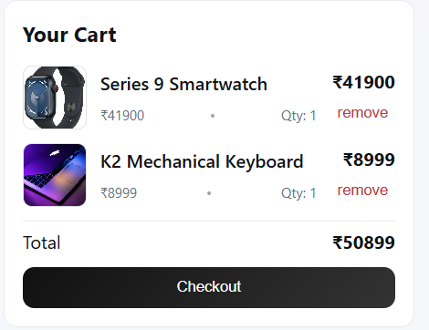
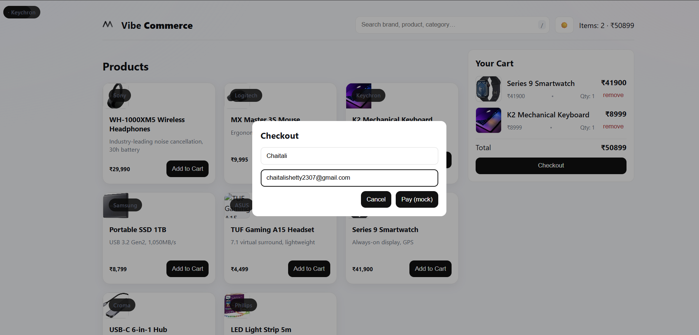
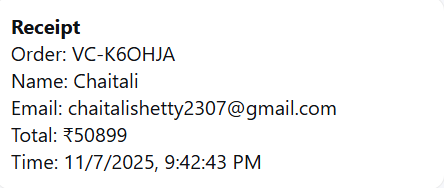
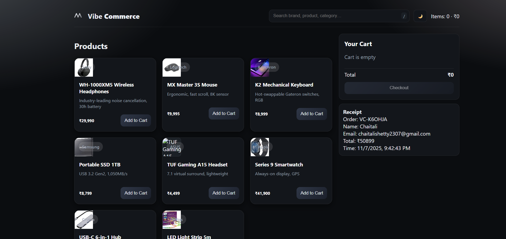
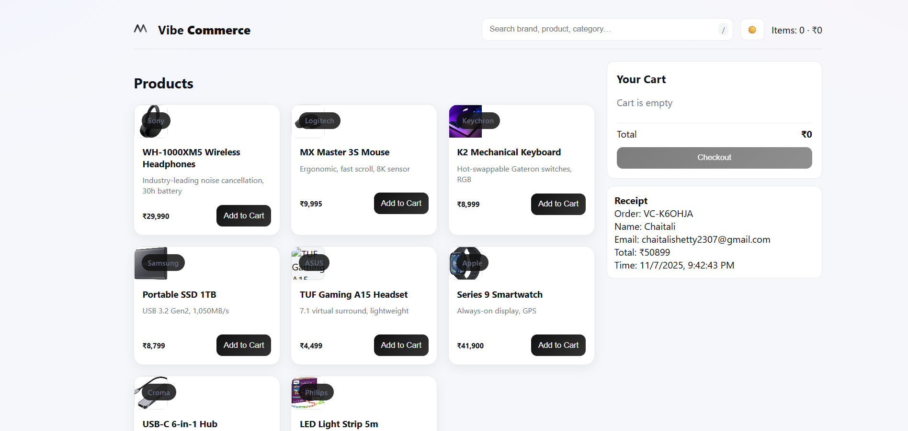

#  Vibe Commerce — Mock E-Com Cart (Assignment)

This is my submission for the **Vibe Commerce Full-Stack Internship Assignment**.  
It is a complete mock e-commerce cart built with **React (frontend)**, **Node/Express (backend)**, and **MongoDB**.

The project implements all required features:  
 Products API  
 Add/Remove cart items  
 View cart with totals  
 Checkout (mock receipt)  
 DB persistence  
 Responsive UI  
 Bonus features (dark mode, search, brand images, related products)

---

##  Tech Stack

### **Frontend**
- React + Vite  
- Modern UI  
- Product grid  
- Cart sidebar  
- Checkout form + modal  
- Search bar  
- Dark mode  
- Related “Perfect for…” product showcase  

### **Backend**
- Node.js + Express  
- REST APIs  
- MongoDB + Mongoose  
- Auto product seeding  
- Mock user cart  
- Error handling  

### **Database**
- MongoDB Community Server  
- Database: `vibe-commerce1`  
- Collections: `products`, `carts`

---

#  Features Implemented

###  **Products**
- `GET /api/products`  
- 8 seeded sample products with **images + brand + title + price**  
- Product grid UI  
- Search by name/brand/category  

###  **Cart**
- Add item to cart  
- Remove item from cart  
- MongoDB persistence for `mock-user-001`  
- Product thumbnail + title shown in cart  
- Quantity, subtotal, and total  

###  **Checkout**
- Modal with name + email  
- Mock receipt generated (orderId, total, timestamp)  
- Cart resets automatically after checkout  

###  **UI Enhancements**
- Dark mode  
- Clean custom Vibe Commerce logo  
- Related products showcase section  
- Toast notifications  

---

#  Installation & Setup

##  1. Clone the repo

```bash
git clone https://github.com/chaitali-shetty/vibe-commerce-assignment.git
cd vibe-commerce-assignment
```
##  Backend Setup
- cd backend
- npm install
- Create `.env`:
  PORT=5000  
  MONGODB_URI=mongodb://127.0.0.1:27017/vibe-commerce1
- Seed sample products:
  npm run seed
- Run backend server:
  npm run dev
- Backend runs at:
  http://localhost:5000

---

##  Frontend Setup
- cd ../frontend
- npm install
- npm run dev
- Frontend runs at:
  http://localhost:3000

---

##  API Endpoints

### Products
- GET /api/products

### Cart
- GET /api/cart
- POST /api/cart
- DELETE /api/cart/:id

### Checkout
- POST /api/checkout   { cartItems }
## Screenshots







